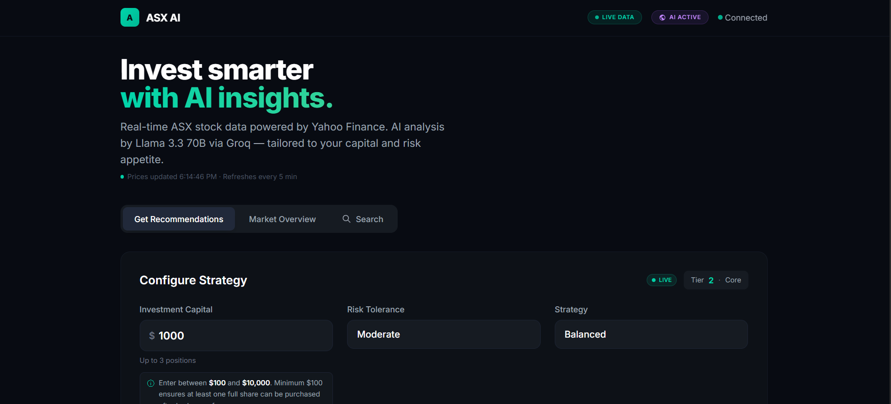
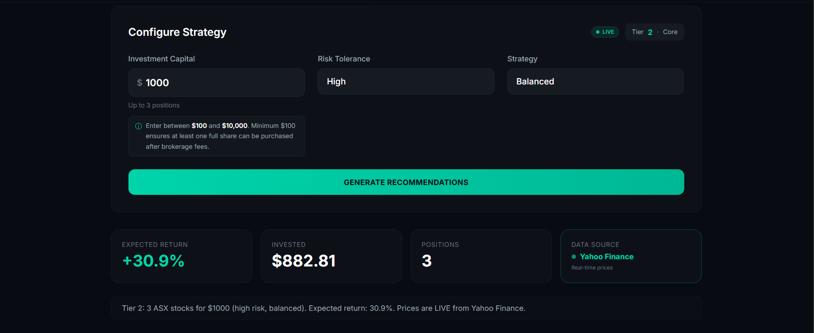
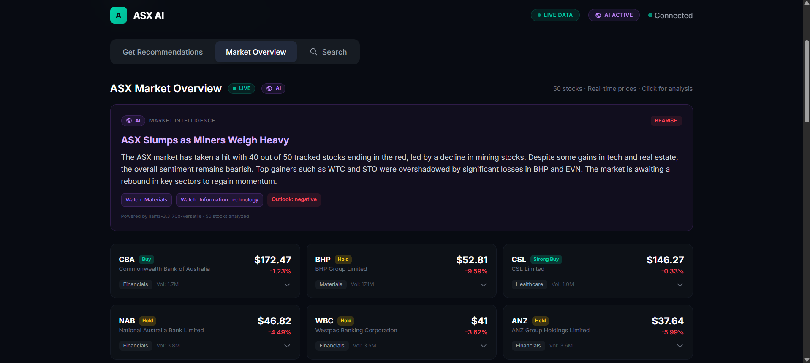

# 📈 ASX AI Investment Platform

**Real-time AI-powered stock analysis and investment recommendations for the Australian Stock Exchange.**

> Live prices from Yahoo Finance · AI analysis by Llama 3.3 70B · Personalized recommendations for $50–$10,000

🔗 **[Live Demo](https://frontend-blond-two-59.vercel.app)** · 🔌 **[API](https://asx-ai-investment-platform.vercel.app)**

---

## Screenshots

| Dashboard | Stock Detail | AI Analysis |
|-----------|-------------|-------------|
|  |  |  |

---

## What It Does

A full-stack web application that tracks **50 ASX stocks in real time** and uses a **70-billion parameter AI model** to provide market analysis, stock recommendations, and portfolio construction — all running for **$0/month**.

### 🧠 AI Stock Analysis
Click any stock to get an instant AI-generated analysis:
- **Sentiment** — Bullish / Neutral / Bearish
- **Target Price** — AI's predicted price target
- **Confidence Score** — How certain the AI is (0–100%)
- **Risk Level** — Low / Medium / High
- **Recommendation** — Strong Buy → Strong Sell
- **Written Summary** — 2–3 sentence analysis with reasoning
- **Key Factors** — Tags highlighting what's driving the stock

### 📊 AI Market Summary
One-click market intelligence powered by AI:
- Analyzes the top 5 gainers and top 5 losers
- Generates a market headline and mood (Bullish/Neutral/Bearish)
- Identifies sectors to watch
- Provides a short-term outlook

### 💰 Investment Recommendations
Enter your capital ($50–$10,000), risk tolerance, and strategy:
1. **Algorithmic scoring** ranks all 50 stocks on momentum, value, and growth
2. **Portfolio construction** selects optimal stocks and calculates exact share quantities
3. **AI portfolio analysis** validates the picks — rates the portfolio, explains why the stocks work together, assesses risk, and gives a tip

---

## Tech Stack

| Layer | Technology | Details |
|-------|-----------|---------|
| **Frontend** | React + Vite | Single-page app with dark theme (Stake-inspired) |
| **Styling** | TailwindCSS + Inter font | Responsive, mobile-first, PWA-installable |
| **API** | Python (stdlib only) | `BaseHTTPRequestHandler` — zero pip dependencies |
| **AI Model** | Llama 3.3 70B Versatile | Via Groq API (free tier, ~0.3s response) |
| **Market Data** | Yahoo Finance | Real-time quotes, no API key required |
| **Hosting** | Vercel Serverless | Two projects from one repo, free tier |
| **Parallelism** | ThreadPoolExecutor | 20 workers fetch 50 stocks in <1 second |

---

## Architecture

```
┌──────────────────────────────────────────────┐
│              User's Browser                  │
│         React + Vite + TailwindCSS           │
│     (Dark theme, responsive, PWA-ready)      │
└──────────────────┬───────────────────────────┘
                   │ REST API calls
                   ▼
┌──────────────────────────────────────────────┐
│          Vercel Serverless API               │
│     Python BaseHTTPRequestHandler            │
│                                              │
│  ┌────────────┐ ┌──────────┐ ┌───────────┐  │
│  │  Yahoo     │ │ Groq AI  │ │ Scoring   │  │
│  │  Finance   │ │ Llama    │ │ Engine    │  │
│  │  (50 ASX)  │ │ 3.3 70B  │ │ (Algo)    │  │
│  └────────────┘ └──────────┘ └───────────┘  │
│                                              │
│  ┌────────────────────────────────────────┐  │
│  │ Two caches:                            │  │
│  │  • Stock data: 5-min TTL              │  │
│  │  • AI analysis: 15-min TTL            │  │
│  └────────────────────────────────────────┘  │
└──────────────────────────────────────────────┘
```

---

## API Endpoints

| Method | Endpoint | Description |
|--------|----------|-------------|
| `GET` | `/api/v1/stocks` | All 50 ASX stocks with live quotes |
| `GET` | `/api/v1/stocks/batch` | Batch fetch with full details |
| `GET` | `/api/v1/stocks/{symbol}` | Individual stock with history |
| `GET` | `/api/v1/ai/analyze?symbol=CBA` | AI analysis for a stock |
| `GET` | `/api/v1/ai/market-summary` | AI-powered market overview |
| `POST` | `/api/v1/recommendations/generate` | Generate investment portfolio |
| `GET` | `/health` | API health + AI status check |

---

## ASX Stocks Tracked (50)

**Financials**: CBA, NAB, WBC, ANZ, MQG, QBE, IAG, ASX, ZIP  
**Materials**: BHP, RIO, FMG, MIN, S32, NCM, EVN, NST, LYC, PLS, ORI, AMC, JHX  
**Technology**: ALL, REA, XRO, WTC, APX, SEK, CPU  
**Energy**: WDS, STO, ORG, AGL  
**Healthcare**: CSL, SHL, RMD, MPL  
**Consumer**: WES, WOW, COL, TWE  
**Real Estate**: GMG, SCG, DXS, SGP  
**Infrastructure**: TCL, AZJ, BXB  
**Telecom**: TLS  
**Education**: IEL

---

## Running Locally

### Prerequisites
- Node.js 18+
- Python 3.9+
- Groq API key (free at [console.groq.com](https://console.groq.com))

### Frontend
```bash
cd frontend
npm install
npm run dev
```
Open `http://localhost:5173`

### API
The API uses only Python standard library — no pip install needed.
Set your Groq API key as an environment variable:
```bash
export GROQ_API_KEY="your_key_here"
```

---

## Key Design Decisions

**Why `BaseHTTPRequestHandler` instead of FastAPI?**  
Vercel's Python serverless runtime only supports stdlib. FastAPI + Uvicorn crashes on cold start. The entire API is one file with zero external dependencies.

**Why Groq over OpenAI?**  
Free tier with generous limits (30 req/min, 14,400/day). Llama 3.3 70B is competitive with GPT-4 class models. Response times ~0.3s thanks to Groq's LPU inference hardware.

**Why Yahoo Finance over paid APIs?**  
Free, no API key required, reliable for ASX data. The `/v8/finance/chart/` endpoint provides everything needed — price, volume, fundamentals, history.

**Why two Vercel projects?**  
The API needs to run from the repo root (where `api/index.py` lives). The frontend needs Vite to build from the `frontend/` directory. Vercel doesn't support both in one project, so we deploy two projects from the same repo.

---

## Cost Breakdown

| Service | Tier | Monthly Cost |
|---------|------|-------------|
| Vercel (API) | Hobby | $0 |
| Vercel (Frontend) | Hobby | $0 |
| Yahoo Finance | Free | $0 |
| Groq AI | Free | $0 |
| GitHub | Free | $0 |
| **Total** | | **$0** |

---

## Disclaimer

This platform provides AI-generated stock analysis for **educational purposes only**. It is not financial advice. Always do your own research before investing. Past performance does not guarantee future results.

---

## License

MIT
